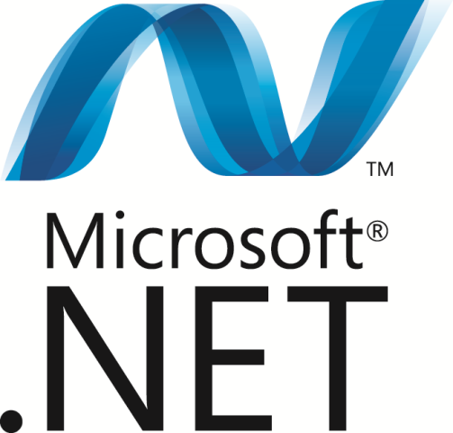
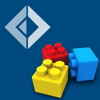
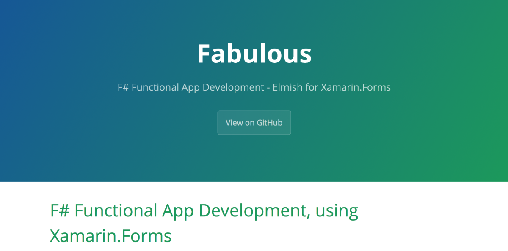
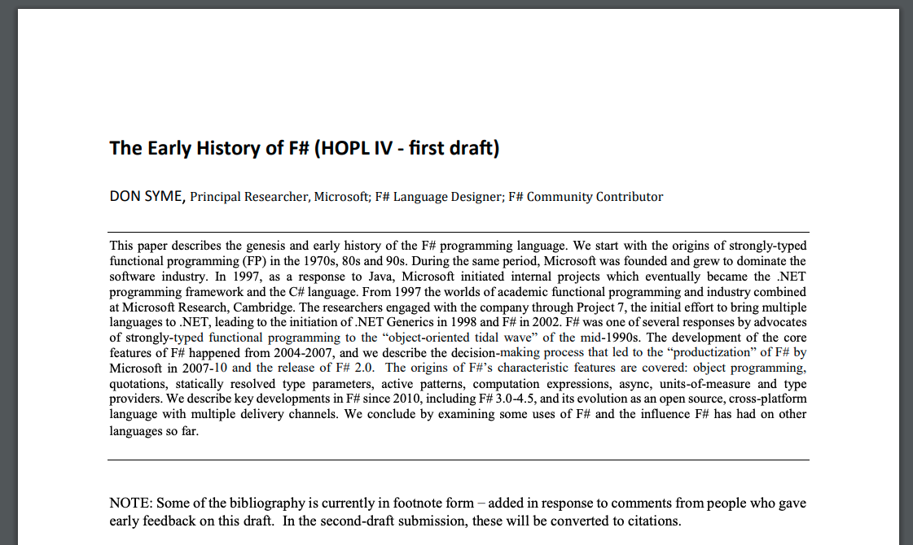
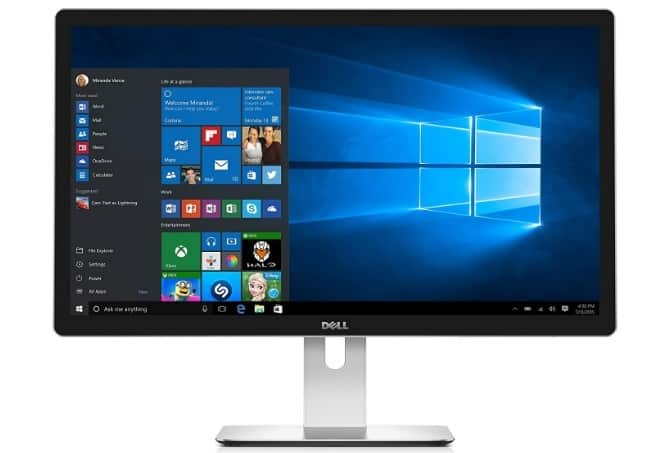
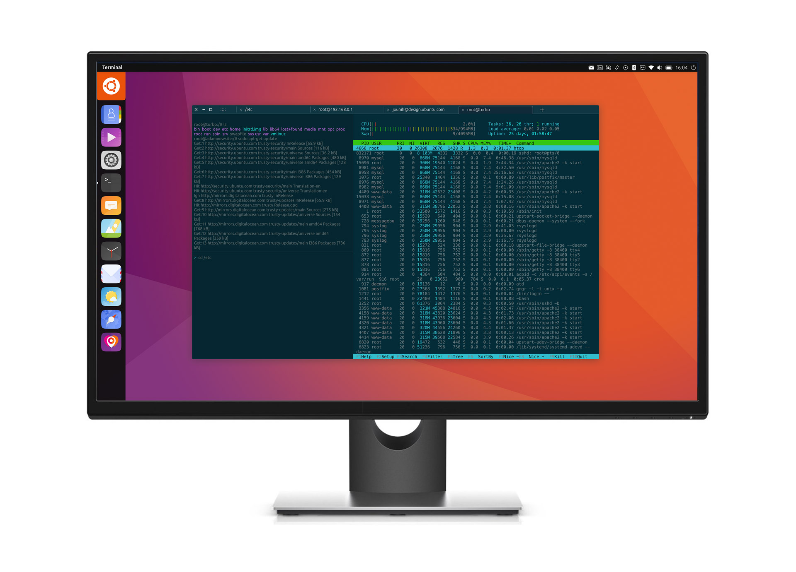
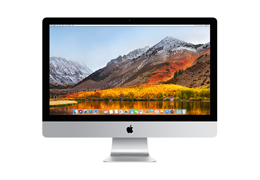

- title : F#: Write once, run (nearly) anywhere!
- description : F#: Write once, run (nearly) anywhere!
- author : Tomasz Heimowski
- theme : black
- transition : default

***

# F#: Write once, run (nearly) anywhere!

Tomasz Heimowski 

*@theimowski*

https://theimowski.com

***

# Plan

- Slogan
- History, evolution
- Platforms
    - Examples with Demo
    - after each mentioned platform, 
    - maybe a bit of live coding
- Mixing platforms
- ? Domains

***

# Slogan

***

# History

---

- data-transition : fade
- data-transition-speed : slow

---

- data-transition : fade
- data-transition-speed : slow

---

- data-transition : fade
- data-transition-speed : slow

---

- data-transition : fade
- data-transition-speed : slow

### FAKE - F# Make

---

- data-transition : fade
- data-transition-speed : slow

---

- data-transition : fade
- data-transition-speed : slow

---

- data-transition : fade
- data-transition-speed : slow

---

- data-transition : fade
- data-transition-speed : slow

---

- data-transition : fade
- data-transition-speed : slow

---

https://fsharp.org/history/

***

# Platforms

- Desktop
- Web
- Mobile
- IoT
- Docker
- Serverless
- Other platforms

***

## Desktop

---

- data-transition : fade
- data-transition-speed : slow

---

- data-transition : fade
- data-transition-speed : slow

---

- data-transition : fade
- data-transition-speed : slow

---

### NET Core 3.0 Supported OS

* Windows Client                | 7 SP1+, 8.1                   | x64, x86       
* Windows 10 Client             | Version 1607+                 | x64, x86       
* Windows Server                | 2008 R2 SP1+                  | x64, x86       
* Mac OS X                      | 10.12+                        | x64            
* Red Hat Enterprise Linux      | 6                             | x64            
* Fedora                        | 28                            | x64            
* Debian                        | 9                      | x64, ARM32, ARM64     
* Ubuntu                        | 16.04+                   | x64, ARM32, ARM64   
* Linux Mint                    | 18                            | x64            
* openSUSE                      | 42.3+                         | x64            
* SUSE Enterprise Linux (SLES)  | 12 SP2+                       | x64            
* Alpine Linux                  | 3.8+                          | x64, ARM64     

[Data from GitHub](https://github.com/dotnet/core/blob/master/release-notes/3.0/3.0-supported-os.md)

---

### Demo

* OSX + Vagrant windows + Vagrant ubuntu
* dotnet new console, run on all OS
* dotnet watch run, print OS name, run on all OS

* Maybe Desktop gui demo after "WEB" ?
* https://github.com/fable-compiler/samples-electron, run on all OS
* mention fabulous: WPF, GTK, Mac

***

## Web

- Fable
- JavaScript
- HTML
- CSS
- ? WASM

---

### Demo

* Fable template
* Elmish
* React
* CSS
* HMR

***

## Mobile

- Xamarin
- Fabulous
- React Native

---

### Demo

* Fabulous app for iOS and Android?

***

## IoT

- Raspberry PI https://github.com/pkese/raspberry-fsharp
- ARM?

---

### Demo

- video? / @forki audio project?

***

## Docker

- .net core docker images

---

### Demo

- e.g. Docker deploy from SAFE template

***

## Serverless

- Azure Functions
- AWS Lambda

---

### Demo

- Azure function

***

## Other platforms

- Fez
- FAKE
- various DSL like Pulumi?
- ... ?

***

# Mixing platforms

- SAFE
- Not just Web apps
- Sharing code

---

### Bonus demo

- Go crazy and reuse code for desktop, JS, server, mobile

***

# ? Domains

***

# Recap

***

### Notes 

- .NET Core
- x-plat
- SDK
- templates
- multi-target (full .net, .net core)
