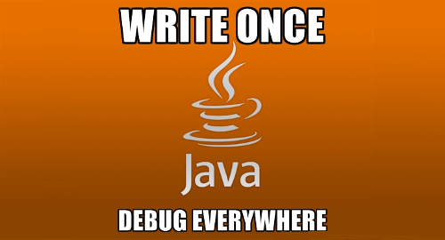
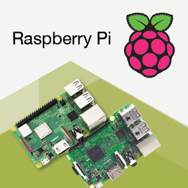
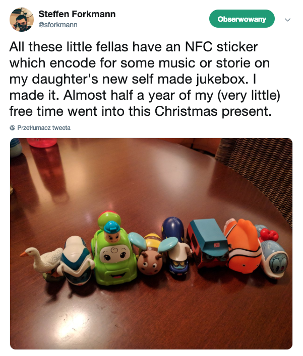
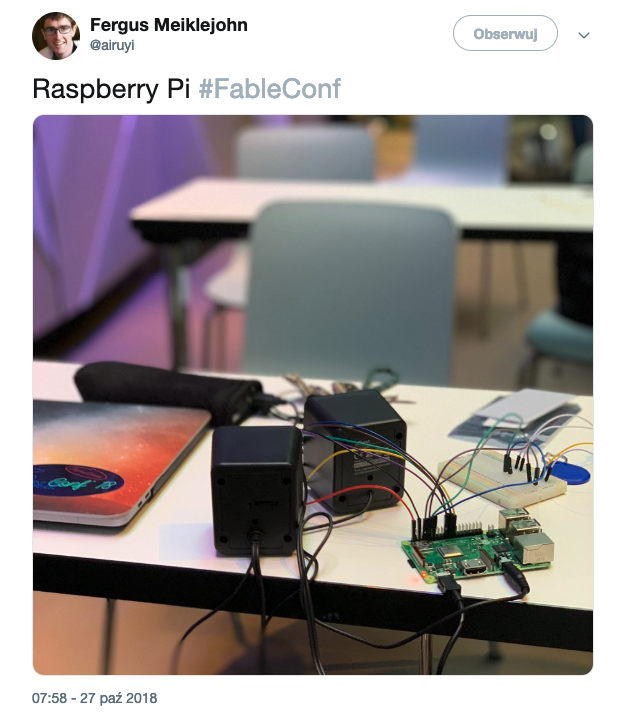
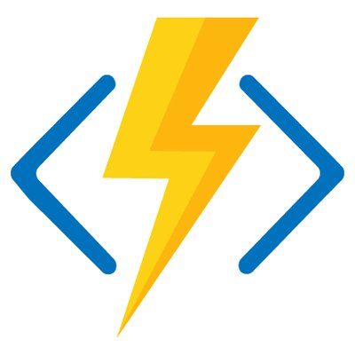
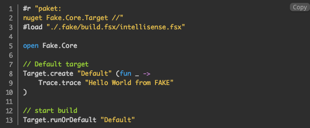
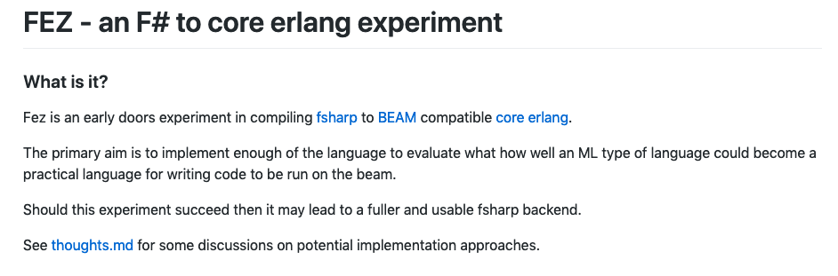
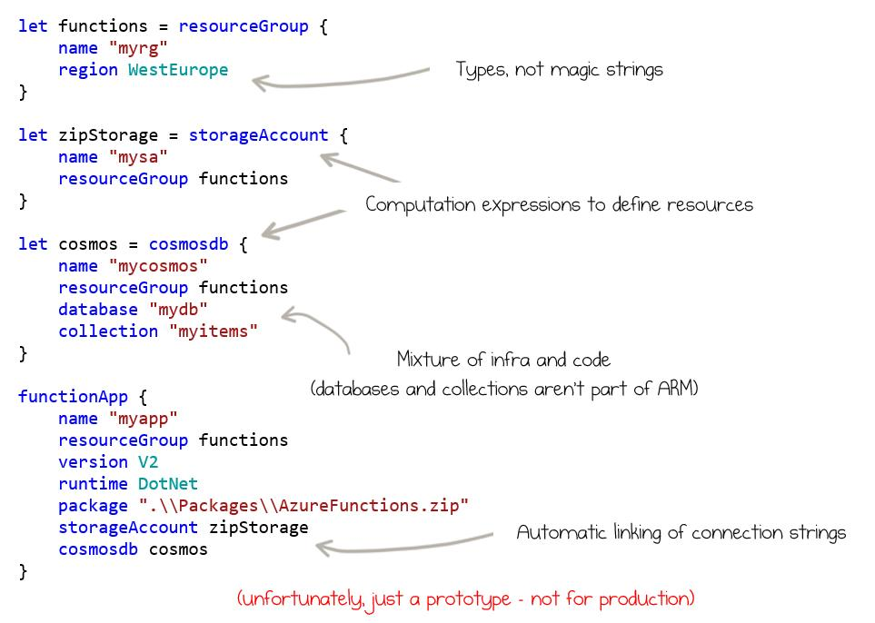

- title : F#: Write once, run (nearly) anywhere!
- description : F#: Write once, run (nearly) anywhere!
- author : Tomasz Heimowski
- theme : black
- transition : default

***

## F#: Write once, 
## run (nearly) anywhere!

Tomasz Heimowski *@theimowski*

https://theimowski.com

***

# Goals

- Review possibilities
- Share experiences
- Inspire ideas
- Praise F#

***

# Plan

- The slogan
- History, evolution
- Platforms
- Mixing platforms

***

# The slogan

## Write once, run anywhere

- Sun Microsystems
- Java cross-platform benefits
- Copied to make my talk more catchy

https://en.wikipedia.org/wiki/Write_once,_run_anywhere

---

---

<small>
https://blog.silentsignal.eu/2014/02/09/jdb-tricks-hacking-java-debug-wire/
</small>

***

# History

- F# evolution
- influential platforms / tools
- possibly not in chronological order

---

https://fsharp.org/history/

---

- data-transition : fade
- data-transition-speed : slow

---

- data-transition : fade
- data-transition-speed : slow

---

- data-transition : fade
- data-transition-speed : slow

---

- data-transition : fade
- data-transition-speed : slow

### FAKE - F# Make

---

- data-transition : fade
- data-transition-speed : slow

---

- data-transition : fade
- data-transition-speed : slow

---

- data-transition : fade
- data-transition-speed : slow

---

- data-transition : fade
- data-transition-speed : slow

---

- data-transition : fade
- data-transition-speed : slow

***

# Platforms

- Desktop
- Mobile
- Web
- IoT
- Docker
- Serverless
- Other platforms

***

## Desktop

 

* .NET Core
* .NET SDK
    * templates
    * watch mode

---

### NET Core 3.0 Supported OS

* Windows Client                | 7 SP1+, 8.1                   | x64, x86       
* Windows 10 Client             | Version 1607+                 | x64, x86       
* Windows Server                | 2008 R2 SP1+                  | x64, x86       
* Mac OS X                      | 10.12+                        | x64            
* Red Hat Enterprise Linux      | 6                             | x64            
* Fedora                        | 28                            | x64            
* Debian                        | 9                      | x64, ARM32, ARM64     
* Ubuntu                        | 16.04+                   | x64, ARM32, ARM64   
* Linux Mint                    | 18                            | x64            
* openSUSE                      | 42.3+                         | x64            
* SUSE Enterprise Linux (SLES)  | 12 SP2+                       | x64            
* Alpine Linux                  | 3.8+                          | x64, ARM64     

<small> https://github.com/dotnet/core/blob/master/release-notes/3.0/3.0-supported-os.md</small>

---

### Desktop Demo

* 3 Operating systems:
    * OSX (local MacBook)
    * Windows (Virtualbox, Vagrant)
    * Ubuntu (Virtualbox, Vagrant)
* Create console app using .NET SDK
* Print OS information
* Run the app on all OS
* Run "watch" mode

https://www.vagrantup.com/

---

### Desktop Demo recap

* Cross-platform .NET SDK
* Easy to set up
* Caution: "watch" + multi OS doesn't work with Paket
* What about GUI?

***

## Web

 

- Frameworks
    - Fable
    - WebSharper
- Output
    - JavaScript
    - HTML
    - CSS

---

---

### Web Demo

* Fable + Elmish + React template
* Hot Module Replacement
* https://fable.io/repl/
* [Giraffe view engine - F# to HTML](https://github.com/giraffe-fsharp/Giraffe/blob/master/DOCUMENTATION.md#giraffe-view-engine)
* [Fable Material UI - F# to CSS](https://mvsmal.github.io/fable-material-ui/#/demos/app-bar)
* [F# Type provider for CSS](https://twitter.com/FableCompiler/status/1098545200899735552)

---

### Web Demo recap

* Seamless integration with JS ecosystem
* Ability to output also HTML/CSS from F#
* Not only Web - Node.js

***

## Desktop GUI

* Electron https://electronjs.org/
    * uses Node.js and Chromium
    * F# -> Fable -> JS -> Electron
* Fabulous
    * WPF
    * GTK
    * Mac

---

### Desktop GUI Demo

* 3 Operating systems:
    * OSX (local MacBook)
    * Windows (Virtualbox, Vagrant)
    * Ubuntu (Virtualbox, Vagrant)
* Create app from fable-electron template
* Print OS information
* Run the app on all OS

***

## Mobile

- Frameworks
    - Xamarin + Fabulous
    - React Native (again via Fable)
- Targets
    - Android
    - iOS

---

### Mobile Demo

* iOS and Android
* Fabulous dotnet template

---

### Mobile talks

* Jim Bennett - Build Cross-Platform Mobile Apps Using Fabulous
* Kunjan Dalal - From Concept to Creation in a Week with Fabulous 

***

## IoT

 

- .NET Core to ARM architecture
    - linux-arm
    - win-arm

---

--- 

 

<small> https://twitter.com/airuyi/status/1056198418501124096 </small>

---

https://twitter.com/sforkmann/status/1049722323262160898

***

## Docker

https://hub.docker.com/_/microsoft-dotnet-core

* >10M pulls from Docker Hub
* Featured Repos:
  * .NET Core SDK
  * ASP.NET Core Runtime
  * .NET Core Runtime
  * .NET Core Runtime Dependencies
  * .NET Core Samples

---

## Docker

`--deploy docker` option for [SAFE Template](https://github.com/SAFE-Stack/SAFE-template)

***

## Serverless

- Azure Functions
    - https://docs.microsoft.com/pl-pl/azure/azure-functions/functions-reference-fsharp
    - Talk: Mikhail Shilkov - Durable F#unctions
- AWS Lambda
    - https://aws.amazon.com/blogs/developer/f-tooling-support-for-aws-lambda/
- Google Cloud
    - no official F# support, but can do F# -> Node.js

***

## Other platforms & tools

---

### Tests

* https://github.com/fsprojects/FsUnit
* https://github.com/haf/expecto
* https://github.com/fscheck/FsCheck
* https://github.com/SwensenSoftware/unquote

---

### Fake

--> https://fake.build/

---

### Fez

https://github.com/kjnilsson/fez

--> [FEZ - fsharp type safety for the BEAM](https://skillsmatter.com/skillscasts/11312-fez-fsharp-type-safety-for-the-beam) (F# eXchange '18)

---

### Pulumi

<small> https://twitter.com/MikhailShilkov/status/1097408586349719552 </small>

--> Lightning Talk: Cloud Infrastructure as F# 

---

### More?

***

# Mixing platforms

---

## SAFE - Web

 
 

* Web server: F# -> .NET Core
* Web client: F# -> JavaScript
* Shared F# code:
    * Remote call protocols
    * Server-side & client-side validation
    * etc...
* https://safe-stack.github.io/docs/
* https://github.com/SAFE-Stack/SAFE-BookStore

---

## SAFE - Mobile

 
 

* REST API: F# -> .NET Core
* Mobile apps: F# -> JS -> React Native -> iOS + Android
* Shared F# code:
    * Business logic
    * Mobile device OS classification
    * etc...
* https://github.com/SAFE-Stack/SAFE-Nightwatch

---

## SAFE - IoT

 
 

* Web server: F# -> .NET Core
* Web client: F# -> JavaScript
* Raspberry PI: F# -> .NET Core (linux-arm RID)
* Shared F# code:
    * Determining firmware
    * Communication protocol
    * etc...
* https://github.com/forki/audio

---

## SAFE - Desktop

 

* Remote Desktop in a browser (alpha version)
* Device Agent: 
    * F# -> .NET Core and .NET 4.0
    * Windows, OSX and Linux
* Browser viewer: F# -> JS
* Shared F# code:
    * HTTP & WebSocket payload DTOs
    * JSON serialisation (Thoth.Json)
    * Protocol for Web Remote Desktop (Apache Guacamole)

---

- data-background : images/datto-rmm-rto-screen.png
- data-background-size : contain

---

## SAFE - All inclusive?

 
 

- Desktop
- Mobile
- Web
- IoT
- Docker
- Serverless
- Other?

---

## SAFE Talks

* Anthony Brown - Workshop: Up and Running with the SAFE Stack
* Tomasz Heimowski - F# SAFE Stack: Current State

***

# Recap

* Great tools -> evolution
* F# targets many platforms
* Combining platforms & sharing code

***

# Thank you!

Slides available at 

https://theimowski.com/talk-fsharp-write-once